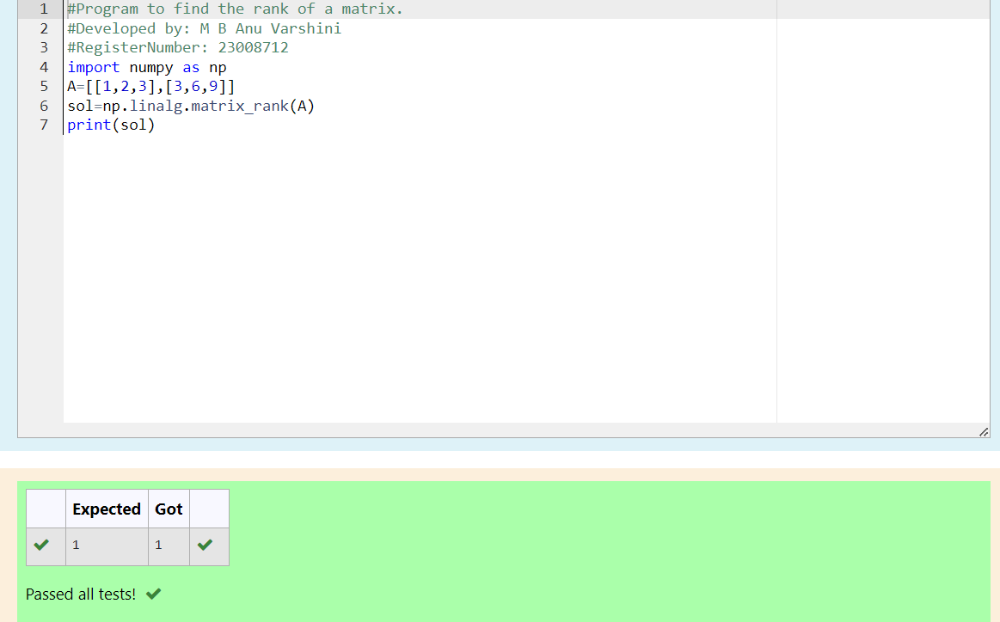

# RANK-OF-A-MATRIX
## Aim:
To write a python program to find the rank of a matrix
## Equipment’s required:
1. 	Hardware – PCs
2. 	Anaconda – Python 3.7 Installation / Moodle-Code Runner
## Algorithm:
### Step 1: 
Import the NumPy library as 'np' for numerical operations.
### Step 2:
Create a 2x3 matrix A with values [[1, 2, 3], [3, 6, 9]]. 
### Step 3:
Using the np.linalg.matrix_rank(), we can find the rank of the given matrix.
### Step 4:
 Print the calculated rank of matrix A. 
## Program:
```PYTHON
#Program to find the rank of a matrix.
#Developed by: M B Anu Varshini
#RegisterNumber: 23008712
import numpy as np
A=[[1,2,3],[3,6,9]]
sol=np.linalg.matrix_rank(A)
print(sol)```
## Output:

## Result:
Thus the rank for the given matrix is successfully solved by  using a python program.